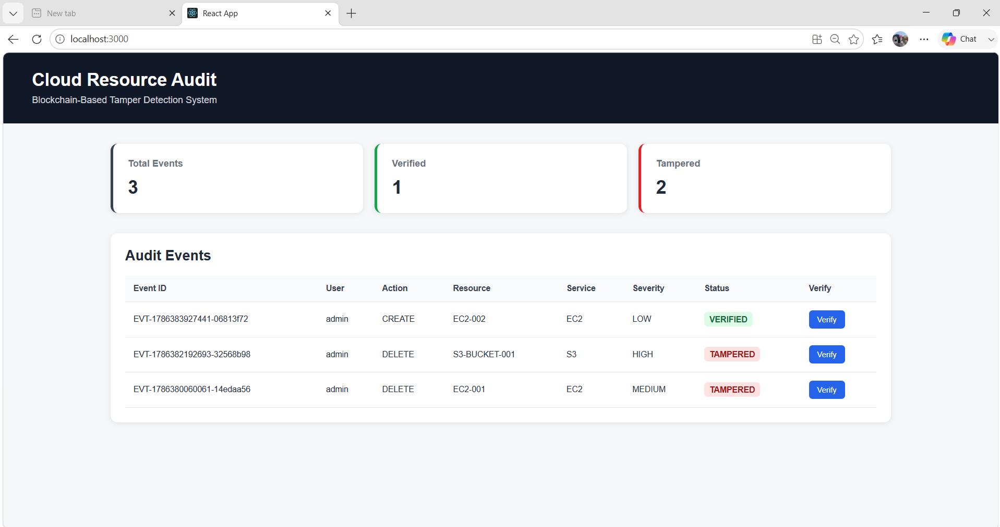
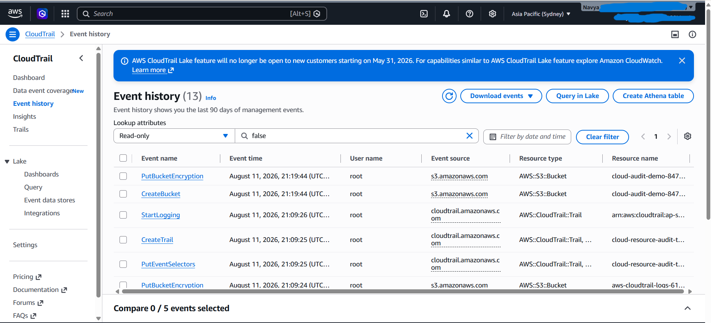
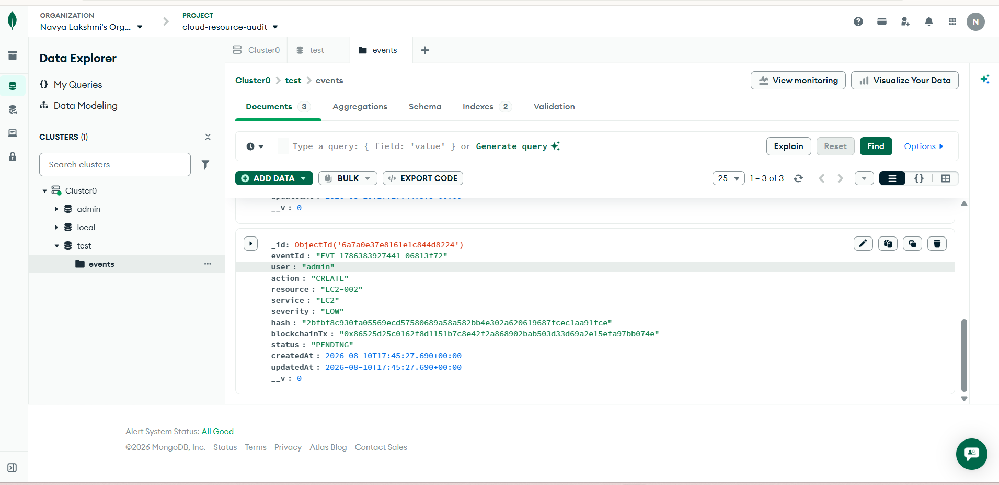
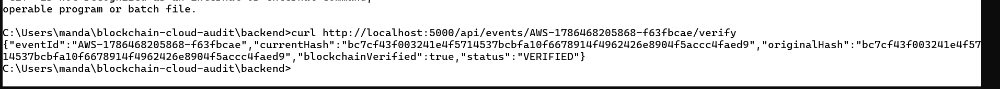
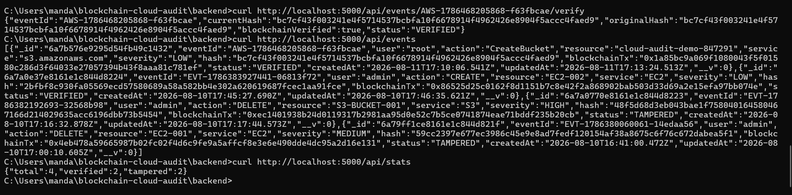
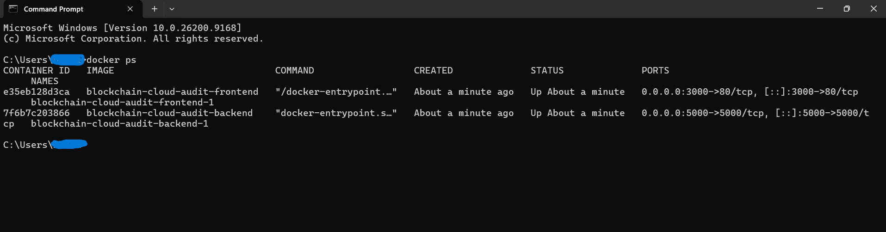
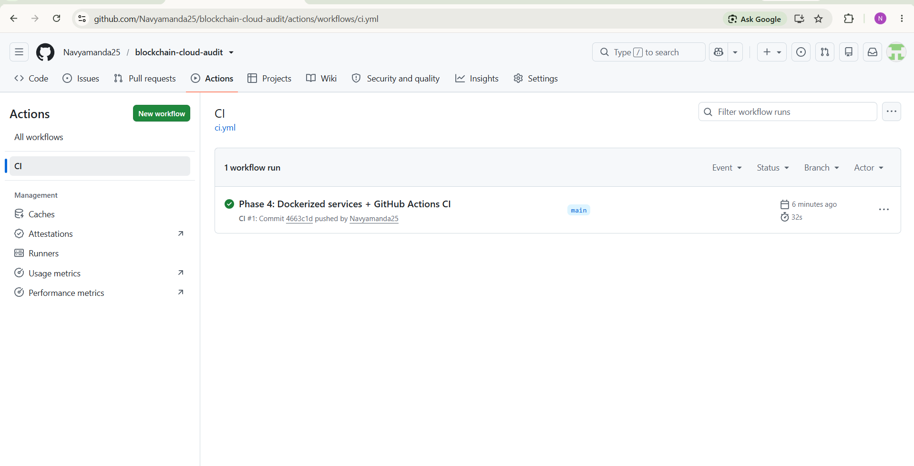

<div align="center">

# 🔐 Cloud Security Audit & Blockchain Integrity Platform

### ☁️ AWS CloudTrail → 🔐 SHA-256 → 🗄️ MongoDB → ⛓️ Blockchain → 🔎 Verification

A cloud security auditing platform that captures AWS cloud activity, generates cryptographic integrity proofs, stores audit records in MongoDB, and detects tampering through blockchain-based verification.


---

### ⚡ Cloud Activity → Audit Event → Cryptographic Proof → Blockchain → Verification

Production-oriented cloud security architecture built using:

☁️ AWS CloudTrail • 🟢 Node.js • ⚛️ React • 🗄️ MongoDB Atlas • ⛓️ Solidity • 🔐 SHA-256 • 🐳 Docker • 🤖 GitHub Actions

</div>

---

# 🌟 Features

### ☁️ Cloud Security

- AWS CloudTrail event integration
- Cloud activity auditing
- AWS resource and action tracking
- Event severity classification
- Structured audit records

### 🔐 Security & Integrity

- JWT Authentication
- Role-Based Access Control (RBAC)
- SHA-256 cryptographic hashing
- Blockchain integrity verification
- Tamper detection

### ⛓️ Blockchain

- Solidity `AuditLog` smart contract
- Event hash recording
- Blockchain transaction tracking
- Original hash verification
- Tamper-evident audit records

### 🐳 DevOps & CI

- Docker containerization
- Docker Compose
- Nginx
- GitHub Actions CI
- Automated frontend build verification

---

# ⚡ Audit Pipeline

```text
☁️ Cloud Activity
        ↓
☁️ AWS CloudTrail
        ↓
🟢 Node.js + Express
        ↓
🚨 Severity Classification
        ↓
🔐 SHA-256 Hash
        ↓
   ┌────┴────┐
   ↓         ↓
🗄️ MongoDB  ⛓️ Blockchain
   ↓         ↓
   └────┬────┘
        ↓
🔎 Hash Verification
        ↓
   ┌───────────────┐
   │ Match         │ → ✅ VERIFIED
   │ Mismatch      │ → ⚠️ TAMPERED
   └───────────────┘
        ↓
⚛️ React Dashboard
```

---

# 🏗️ Architecture

```text
                         ☁️ AWS Cloud
                              │
                              ▼
                       AWS CloudTrail
                              │
                              ▼
                     Node.js + Express
                              │
                 ┌────────────┴────────────┐
                 │                         │
                 ▼                         ▼
            🔐 SHA-256                 🔑 JWT + RBAC
                 │
          ┌──────┴──────┐
          │             │
          ▼             ▼
     🗄️ MongoDB     ⛓️ Blockchain
          │             │
          └──────┬──────┘
                 ▼
          🔎 Hash Verification
                 │
                 ▼
          ⚛️ React Dashboard
```

---

# 🔥 Why This Project?

Traditional audit records can be modified after they are stored.

This project combines **cloud auditing, cryptographic hashing, database storage, and blockchain verification** to make cloud audit records tamper-evident.

It demonstrates:

- ☁️ Cloud Security Auditing
- 🔐 Cryptographic Integrity
- ⛓️ Blockchain Verification
- 🚨 Tamper Detection
- 🔑 Authentication & RBAC
- 🐳 Containerized Deployment
- 🤖 Continuous Integration

---

# 🧠 Audit Workflow

```text
Cloud Activity
      ↓
AWS CloudTrail Event
      ↓
Severity Classification
      ↓
SHA-256 Hash
      ↓
MongoDB + Blockchain
      ↓
Hash Verification
      ↓
┌──────────────────────────┐
│ Match    → ✅ VERIFIED   │
│ Mismatch → ⚠️ TAMPERED  │
└──────────────────────────┘
```

---

# 📊 Dashboard

The React dashboard provides a centralized view of cloud audit activity.

### Dashboard includes

- 📌 Total Events
- ✅ Verified Events
- ⚠️ Tampered Events
- 👤 User
- 🔧 Action
- ☁️ Cloud Resource
- 🛠️ AWS Service
- 🚨 Severity
- 🔎 Verification Status

<div align="center">



</div>

---

# ☁️ AWS CloudTrail

AWS CloudTrail provides the source cloud activity events used by the audit pipeline.

The system processes CloudTrail events and converts them into structured audit records.

<div align="center">



</div>

---

# 🗄️ MongoDB Audit Records

Complete audit records are stored in MongoDB Atlas.

Each audit record contains information such as:

- 🆔 Event ID
- 👤 User
- 🔧 Action
- ☁️ Resource
- 🛠️ Service
- 🚨 Severity
- 🔐 SHA-256 Hash
- ⛓️ Blockchain Transaction
- 🔎 Verification Status

<div align="center">



</div>

---

# 🔐 Cryptographic Integrity

The system generates a **SHA-256 cryptographic hash** from the audit record.

The complete audit information remains in MongoDB while its cryptographic proof is recorded on the blockchain.

```text
Complete Audit Record
          ↓
       SHA-256
          ↓
   Cryptographic Hash
       ↙       ↘
  🗄️ MongoDB  ⛓️ Blockchain
```

---

# ⛓️ Blockchain Verification

During verification, the system compares the current record hash with the original integrity proof stored on the blockchain.

```text
Current Record
      ↓
New SHA-256 Hash
      ↓
Blockchain Hash
      ↓
Hash Comparison
      ↓
✅ VERIFIED / ⚠️ TAMPERED
```

<div align="center">



</div>

---

# 🚨 Tamper Detection

If an audit record is modified after its original cryptographic proof is recorded, the newly generated hash will differ from the blockchain hash.

```text
Original Audit Record
        ↓
Original SHA-256 Hash
        ↓
Blockchain Proof
        ↓
Record Modified
        ↓
New SHA-256 Hash
        ↓
Hash Comparison
        ↓
⚠️ TAMPERED
```

<div align="center">



</div>

---

# 🛡️ Event Severity

The system classifies cloud audit events according to their security impact.

```text
🟢 LOW
🟡 MEDIUM
🟠 HIGH
🔴 CRITICAL
```

### Examples

```text
CreateBucket → LOW
CreateUser   → CRITICAL
```

---

# 🔑 Authentication & RBAC

The platform uses JWT-based authentication and role-based authorization.

| Role | Access |
|---|---|
| 👑 Admin | Full audit management |
| 🛡️ Auditor | Create, import and verify audit events |
| 👁️ Viewer | View events and statistics |

Protected API routes enforce access based on the user's role.

---

# 🐳 Docker

The application is containerized using Docker and Docker Compose.

```text
                 🐳 Docker Compose
                       │
          ┌────────────┴────────────┐
          │                         │
          ▼                         ▼
     ⚛️ Frontend                🟢 Backend
        Nginx                  Node.js + Express
      Port 3000                  Port 5000
```

<div align="center">



</div>

Run the complete application:

```bash
docker compose up --build
```

---

# 🤖 GitHub Actions CI

GitHub Actions automatically validates the application build.

```text
Push Code
    ↓
Checkout Repository
    ↓
Setup Node.js
    ↓
Install Dependencies
    ↓
Build Frontend
    ↓
✅ CI Success
```

<div align="center">



</div>

---

# 🛠️ Technology Stack

| Layer | Technologies |
|---|---|
| ☁️ Cloud | AWS CloudTrail |
| ⚛️ Frontend | React, Axios, Recharts |
| 🟢 Backend | Node.js, Express |
| 🗄️ Database | MongoDB Atlas |
| ⛓️ Blockchain | Solidity, Hardhat, Ethers.js |
| 🔐 Security | SHA-256, JWT, RBAC |
| 🐳 DevOps | Docker, Docker Compose, Nginx |
| 🤖 CI/CD | GitHub Actions |

---

# 📂 Project Structure

```text
blockchain-cloud-audit/
│
├── .github/
│   └── workflows/
│       └── ci.yml
│
├── backend/
│   ├── src/
│   ├── Dockerfile
│   └── package.json
│
├── blockchain/
│   ├── contracts/
│   ├── scripts/
│   └── hardhat.config.ts
│
├── frontend/
│   ├── src/
│   ├── public/
│   ├── Dockerfile
│   └── package.json
│
├── docs/
│   └── screenshots/
│
├── docker-compose.yml
├── LICENSE
└── README.md
```

---

# 🚀 Quick Start

### 📥 Clone Repository

```bash
git clone https://github.com/Navyamanda25/blockchain-cloud-audit.git
cd blockchain-cloud-audit
```

### 🟢 Backend

```bash
cd backend
npm install
npm start
```

Backend:

```text
http://localhost:5000
```

### ⚛️ Frontend

```bash
cd frontend
npm install
npm start
```

Frontend:

```text
http://localhost:3000
```

### ⛓️ Blockchain

```bash
cd blockchain
npm install
npx hardhat node
```

Deploy the smart contract:

```bash
npx hardhat run scripts/deploy.js --network localhost
```

### 🐳 Docker

From the project root:

```bash
docker compose up --build
```

---

# 🔒 Security

Sensitive credentials are stored using environment variables and excluded from Git.

### 🚫 Never commit

```text
.env
AWS credentials
Private keys
JWT secrets
MongoDB passwords
API keys
```

---

# 📈 Learning Outcomes

This project provided hands-on experience with:

- ☁️ AWS Cloud Security
- 🔎 AWS CloudTrail
- 🔐 SHA-256 Cryptography
- ⛓️ Blockchain & Solidity
- 🗄️ MongoDB Atlas
- 🟢 Node.js & Express
- ⚛️ React
- 🔑 JWT & RBAC
- 🐳 Docker
- 🤖 GitHub Actions

---

<div align="center">

# 👩‍💻 Author

### **Navya Lakshmi Manda**

B.Tech — Computer Science & Engineering

☁️ Cloud Computing • 🔐 Cybersecurity • ⛓️ Blockchain • ⚛️ Full Stack Development

**🔐 Built with AWS + Blockchain + Cryptography + MongoDB + React + Docker**

⭐ If you find this project useful, consider giving it a star!

</div>
